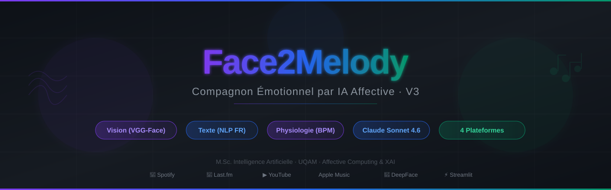
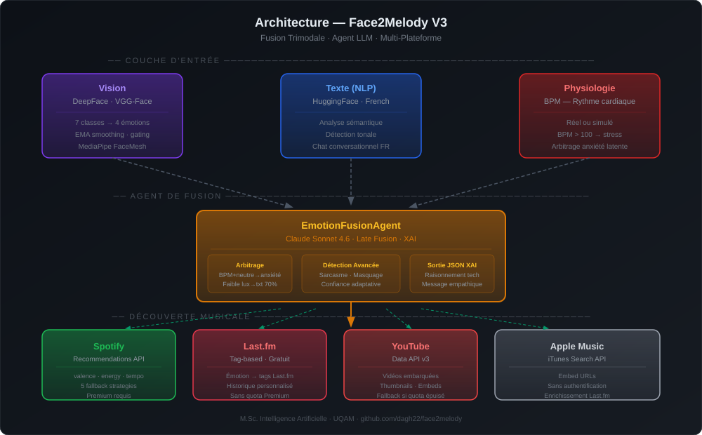
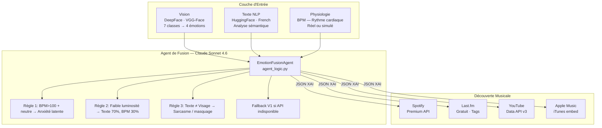
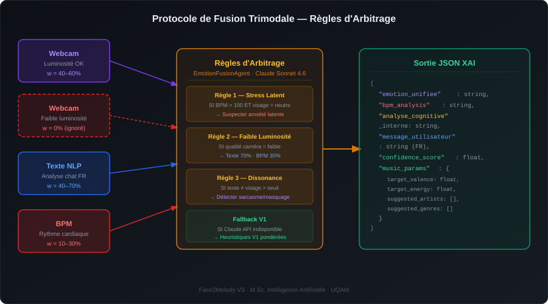
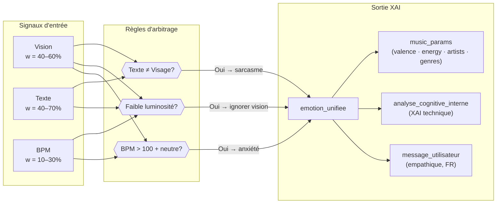
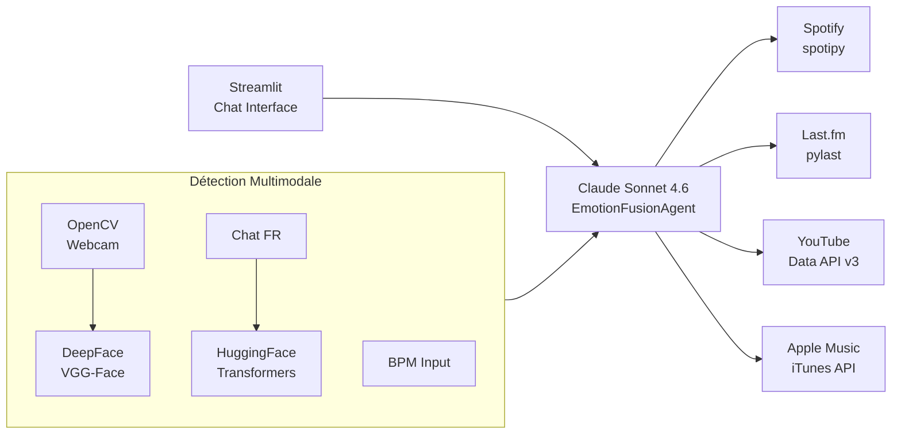

<div align="center">




</div>

---

## Nouveautés V3 — Fusion Trimode & Agnosticisme Plateforme

| Fonctionnalité | V1/V2 | V3 |
|---|---|---|
| Modalités d'entrée | Vision + Texte | **Vision + Texte + Physiologie (BPM)** |
| Agent cognitif | Heuristiques pondérées | **Claude Sonnet 4.6 (LLM Late Fusion)** |
| Plateformes musicales | Spotify uniquement | **Spotify + Last.fm + YouTube + Apple Music** |
| Explicabilité (XAI) | Label émotion | **Raisonnement technique + message empathique** |
| Détection d'anomalies | Non | **Anxiété latente, sarcasme, masquage émotionnel** |
| Qualité caméra | Non prise en compte | **Ajustement dynamique des poids selon luminosité** |

---

## Vue d'ensemble

**Face2Melody** est passé d'un outil de recommandation musicale à un **Compagnon Émotionnel**. Il détecte l'état affectif de l'utilisateur via trois modalités complémentaires et génère des recommandations musicales adaptées sur plusieurs plateformes, avec une justification XAI empathique en français.

> *La fusion trimodale (vision + texte + physiologie) améliore-t-elle la pertinence perçue des recommandations musicales par rapport aux approches bimodales ou heuristiques ?*

---

## Architecture Système





---

## Protocole de Fusion Trimodale





---

## Stack Technique



| Couche | Technologie |
|---|---|
| UI | Streamlit ≥ 1.35 (mode chat `st.chat_message`) |
| Agent LLM | Claude Sonnet 4.6 (Anthropic API) |
| Détection faciale | DeepFace 0.0.93 + VGG-Face |
| Landmarks | MediaPipe FaceMesh |
| Vision | OpenCV ≥ 4.8 |
| Deep Learning | TensorFlow 2.15 (tensorflow-macos sur Apple Silicon) |
| NLP | HuggingFace Transformers ≥ 4.44 + PyTorch CPU |
| Musique | Spotipy ≥ 2.19 · pylast ≥ 5.1 · YouTube Data API v3 · iTunes API |
| Data | pandas, numpy < 2.0, Altair |
| Config | python-dotenv |

---

## Classes Émotionnelles & Paramètres Musicaux

| Émotion | Valence | Énergie | Tempo | Genres suggérés |
|---------|---------|---------|-------|-----------------|
| Heureux | Élevée | Élevée | Rapide | pop, dance, funk |
| Triste | Faible | Faible | Lent | acoustic, piano, indie |
| Anxieux | Faible | Moyenne | Varié | ambient, classical |
| En colère | Faible | Élevée | Rapide | metal, rock, hip-hop |
| Neutre | Moyenne | Moyenne | Moyen | ambient, chill, lo-fi |

---

## Installation

### Prérequis
- Python 3.9–3.11
- Webcam (pour la détection faciale)
- Compte [Spotify Developer](https://developer.spotify.com/dashboard) (optionnel)
- Clé API [Last.fm](https://www.last.fm/api/account/create) (gratuite, recommandée)
- Clé API [YouTube Data v3](https://console.cloud.google.com/) (optionnelle)

### 1. Cloner le dépôt (branche v3)
```bash
git clone -b v3 https://github.com/dagh22/face2melody.git
cd face2melody
```

### 2. Environnement virtuel
```bash
python -m venv .venv
source .venv/bin/activate   # Windows: .venv\Scripts\activate
```

### 3. Installer les dépendances

**Standard (Intel/AMD) :**
```bash
pip install --upgrade pip
pip install tensorflow==2.15.1
pip install -r requirements.txt
```

**Apple Silicon (M1/M2/M3) :**
```bash
pip install --upgrade pip
pip install tensorflow-macos==2.15.0 tensorflow-metal==1.1.0
pip install -r requirements.txt
```

### 4. Variables d'environnement

Créer un fichier `.env` à la racine :
```env
# Agent LLM (requis pour la fusion trimode V3)
ANTHROPIC_API_KEY=your_anthropic_api_key

# Spotify (optionnel — recommandations Premium)
SPOTIPY_CLIENT_ID=your_spotify_client_id
SPOTIPY_CLIENT_SECRET=your_spotify_client_secret
SPOTIPY_REDIRECT_URI=http://127.0.0.1:8501/callback

# Last.fm (recommandé — gratuit)
LASTFM_API_KEY=your_lastfm_api_key
LASTFM_API_SECRET=your_lastfm_api_secret

# YouTube (optionnel)
YOUTUBE_API_KEY=your_youtube_api_key

# Paramètres app
PARTICIPANT_ID=YOUR_NAME
F2M_ENABLE_DEEPFACE=1
```

### 5. Lancer l'application
```bash
streamlit run app.py
```

---

## Structure du Projet

```
face2melody/
├── app.py                          # Application Streamlit principale (V2 + V3)
├── app.v3.py                       # Prototype standalone V3 (Trimode)
├── agent_logic.py                  # EmotionFusionAgent (Claude Sonnet 4.6)
├── experiment_utils.py             # Moteur de fusion + logging
├── feedback_learning.py            # Reclassement par feedback utilisateur
├── analytics_gen.py                # Dashboard analytique recherche
├── test_v1_vs_v2.py                # Suite de validation V1 vs V2 vs V3
├── requirements.txt
├── assets/
│   ├── banner.svg                  # Bannière du projet
│   ├── architecture.svg            # Diagramme d'architecture
│   └── fusion_flow.svg             # Flux de fusion trimodale
├── recommender/
│   ├── emotion_detector.py         # Wrapper DeepFace (lazy init, thread-safe)
│   ├── spotify_interface.py        # Client Spotify OAuth + recommandations
│   ├── lastfm_interface.py         # Client Last.fm (V3)
│   ├── youtube_search.py           # YouTube Data API (V3)
│   ├── itunes_search.py            # Apple Music via iTunes (V3)
│   └── playlist_generator.py      # Génération de playlists en lot
├── archive/                        # Pages Streamlit dépréciées (référence)
└── logs/                           # Logs JSONL participants (gitignored)
```

---

## Confidentialité & Données

Les logs de participants sont stockés localement dans `logs/` et exclus du contrôle de version. Aucune donnée personnelle n'est transmise à un tiers autre que les APIs configurées. L'analyse faciale s'exécute entièrement en local via DeepFace — aucune image n'est stockée ou envoyée à distance.

---

<div align="center">

**Daghsen** — Projet de Recherche M.Sc. Intelligence Artificielle · UQAM  
*Informatique Cognitive / Affective Computing*

</div>
